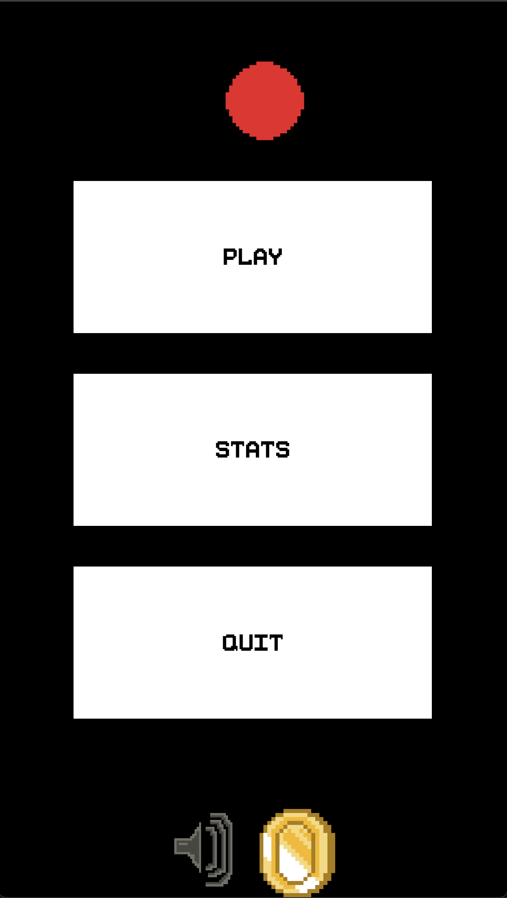
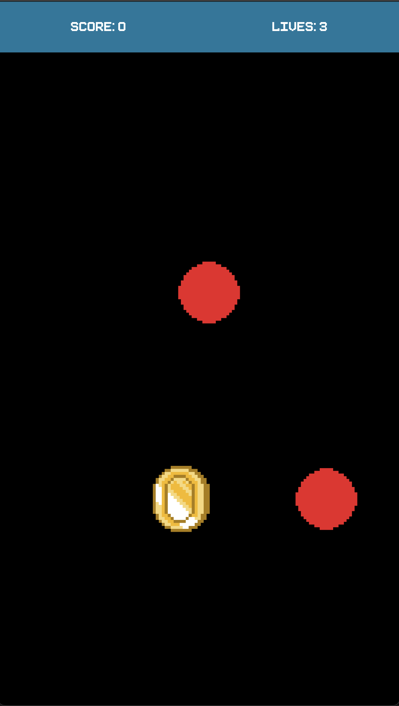
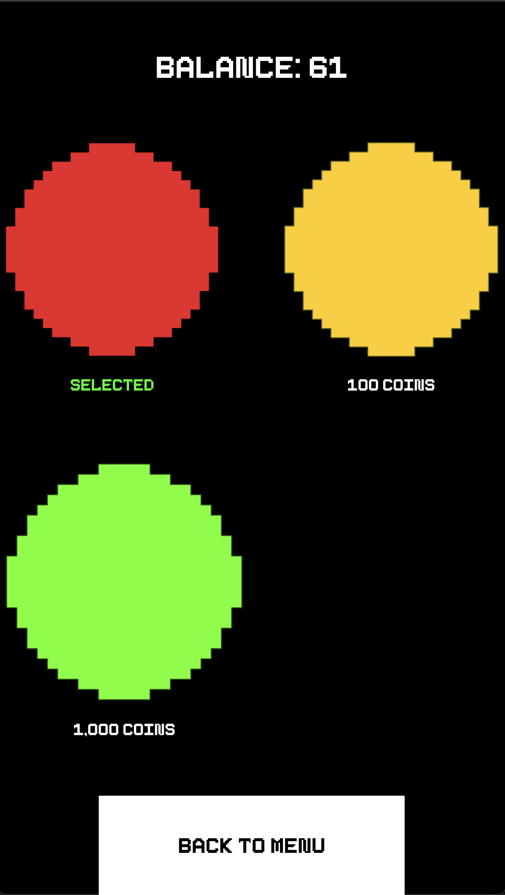

# Shoot The Balls

**Shoot The Balls** is a minimalist arcade game developed in **Python** using the **Kivy** framework. Test your reflexes, collect coins, and unlock new skins while trying to achieve the highest score!

---

## Visual Presentation
Here you can see the game in action:

| Home Screen |               Gameplay               | Shop |
| :---: |:------------------------------------:|-------|
|  |  |  |

---

## Key Features

* **️ Classic Arcade Gameplay:** Balls fall from the top; tap them to destroy them before they reach the bottom edge of the screen.
* **Progressive Difficulty:** The game gets harder as you advance. Every **1000 points**, the level and ball speed increase!
* **Economy and Customization:** Collect special "coin" balls (`ShootTheBallsCoin.png`).
    * Use your coin balance in the **Shop** to buy new skins (e.g., `yellowBila.png`, `greenBila.png`).
* **Persistent Statistics:** The game automatically saves your Highscore and full match history in an **SQLite3** database (`stb.sqlite3`).
* **Retro Aesthetic:** Pixel-art graphics and a custom font (`PixeboyFont.ttf`) for an authentic arcade experience.
* **Audio:** Background music (`troll.ogg`) that can be toggled on or off from the settings.

---

## Technologies Used

The project demonstrates the use of advanced software development concepts:

* **Language:** Python 3
* **GUI Framework:** [Kivy Framework](https://kivy.org/)
* **Database:** SQLite3 (for saving scores and timestamps).
* **Data Storage:** `JsonStore` for coins and unlocked skins.
    * `CSV` for managing shop prices.
* **Time/Localization:** `pytz` and `datetime` for correct display of game sessions.
* **Mobile Ready:** Configured for Android compilation via **Buildozer**.

---

## Download APK

For Android users, you can find the pre-compiled version of the game in the **[Releases](https://github.com/mateirobescu/shoot-the-balls/releases)** section. Simply download the `.apk` file and install it on your device.

---

## How to Run Locally

This project uses **uv** for dependency management. If you don't have it installed, you can get it from [astral.sh](https://astral.sh/uv).

1.  **Clone the repository:**
    ```bash
    git clone [https://github.com/mateirobescu/shoot-the-balls.git](https://github.com/mateirobescu/shoot-the-balls.git)
    cd shoot-the-balls
    ```

2.  **Run the game:**
    `uv` will automatically create a virtual environment and install the required dependencies (like `kivy` and `pytz`) on the first run.
    ```bash
    uv run main.py
    ```

---

## File Structure
* `main.py`: Main game logic and screen management.
* `style.kv`: Visual layout definition (UI).
* `stb.sqlite3`: Database containing game history.
* `skins.json` & `coins.json`: User progress storage.